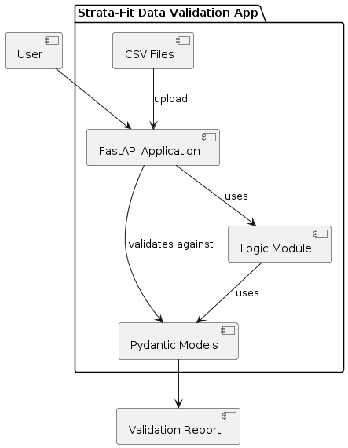
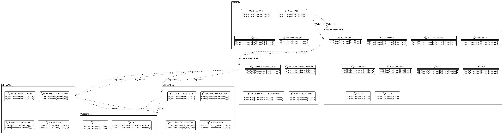
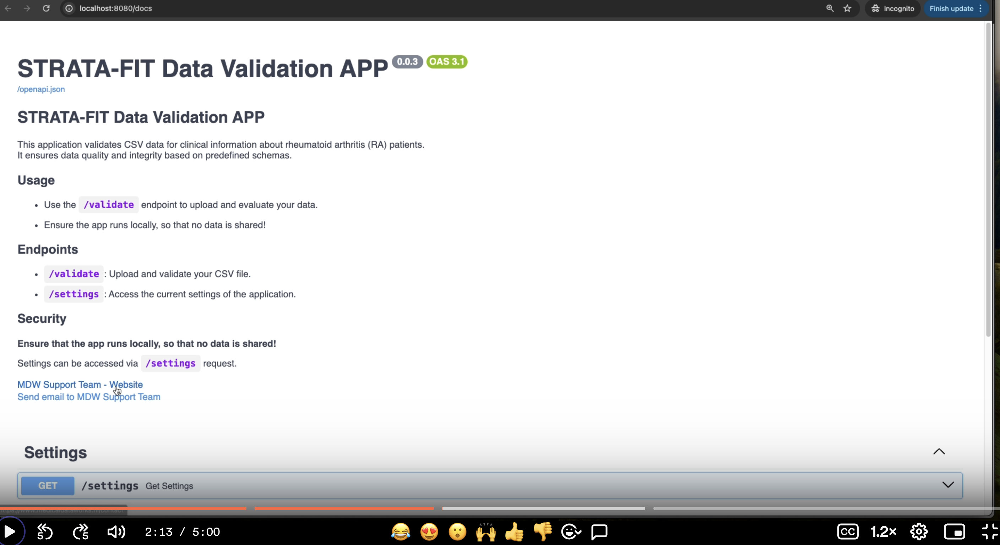

# STRATA-FIT Data Validation App

## Project Description
The Strata-Fit Data Validation Application is a FastAPI-based tool designed to ensure the quality and integrity of CSV data files containing clinical information about patients with rheumatoid arthritis (RA). This application leverages a Pydantic model (PatientData) to validate the data against a predefined schema ensuring it meets specific criteria, such as data type, value range, and required fields.

The application supports file uploads through an API endpoint where users can submit their CSV files to be validated. Errors and discrepancies are reported back in a user-friendly format, making it easier for clinicians and researchers to identify and correct data issues.

## Diagrams
### Component Diagram

### Patient Data Interactions


## Usage

[](https://www.loom.com/share/df44944e2711460a921164e201261044)


### 1. Development Mode
To run the application locally, follow these steps:

#### Step 1: Install Dependencies
Ensure Python 3.10+ is installed, then install required dependencies:
```bash
pip install -r requirements.txt
```

#### Step 2: Run the Application
Use the following command to start the FastAPI server:

```bash
uvicorn app:app --reload
```
The application will be available at http://localhost:8000.

#### Step 3: Interact with the API
Access the API through a web browser or use tools like curl or Postman to upload CSV files for validation:

```bash
curl -F 'file=@path_to_your_file.csv' http://localhost:8000/validate
```

### 2. Dockerized Application
To run the application in a Docker container:

#### Step 1: Pull the Docker Image from the Registry
Pull the latest docker image named strata-fit-data-val:

```bash
docker pull ghcr.io/mdw-nl/strata-fit-data-val
```

#### Step 2: Run the Docker Container
Start a container named `strata-fit-data-validator` mapping the port `8000` inside the container to port `8080` on your host:

```bash
docker run --rm --name strata-fit-data-validator -p 8080:8000 ghcr.io/mdw-nl/strata-fit-data-val
```
The application will be available at http://localhost:8080/docs.

#### Step 3: Interact with the API
Access the API through a [web browser](http://localhost:8080/docs) or use tools like curl or Postman to upload CSV files for validation:

```bash
curl -F 'file=@path_to_your_file.csv' http://localhost:8080/validate
```
